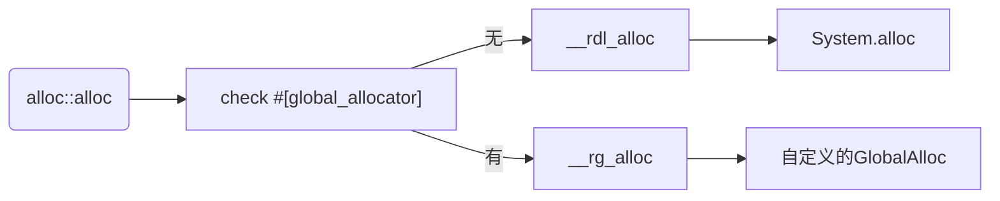

# 怎么申请和释放内存

## `malloc`, `calloc`, `relloc`, `free`等函数在哪？
rust提供了一个接口`GlobalAlloc`对`malloc`, `free`等函数进行了封装
```rust
pub unsafe trait GlobalAlloc {
    unsafe fn alloc(&self, layout: Layout) -> *mut u8;
    unsafe fn dealloc(&self, ptr: *mut u8, layout: Layout);
    unsafe fn alloc_zeroed(&self, layout: Layout) -> *mut u8;
    unsafe fn realloc(&self, ptr: *mut u8, layout: Layout, new_size: usize) -> *mut u8 ;
}
```
|libc|方法|
|-|-|
|malloc|GlobalAlloc::alloc|
|free|GlobalAlloc::dealloc|
|calloc|GlobalAlloc::alloc_zeroed|
|realloc|GlobalAlloc::realloc|


## 使用`GlobalAlloc`
`alloc crate`中提供了4个函数`alloc`,`dealloc`,`alloc_zeroed`,`realloc`分别对应`GlobalAlloc`特征的4个方法。
```rust
use std::alloc::{alloc, dealloc, handle_alloc_error, Layout};

fn main() {
    unsafe {
        let layout = Layout::new::<u16>();
        let ptr = alloc(layout);
        if ptr.is_null() {
            handle_alloc_error(layout);
        }
        *(ptr as *mut u16) = 42;
        assert_eq!(*(ptr as *mut u16), 42);
        dealloc(ptr, layout);
    }
}
```
到这里我们就是自由的操作内存了。

## `GlobalAlloc`有哪些实现
### `System`
`std crate`中`System`实现了`GlobalAlloc`特征。
事实上`System`还实现了`Allocator`特征，后面会说。

平台相关的代码在

|平台|路径|
|-|-|
|unix|`sys/unix/alloc.rs`|
|windows|`sys/windows/alloc.rs`|

## 深入`alloc::alloc`是怎么调用上文中提到的`System`实现的
先看`alloc::alloc`的源代码
```rust
extern "Rust" {
    fn __rust_alloc(size: usize, align: usize) -> *mut u8;
    fn __rust_dealloc(ptr: *mut u8, size: usize, align: usize);
    fn __rust_realloc(ptr: *mut u8, old_size: usize, align: usize, new_size: usize) -> *mut u8;
    fn __rust_alloc_zeroed(size: usize, align: usize) -> *mut u8;
}

pub unsafe fn alloc(layout: Layout) -> *mut u8 {
    unsafe {
        __rust_alloc(layout.size(), layout.align())
    }
}
```
__rust_alloc函数做了什么
- 如果有`#[global_alloctor]`标记的global alloctor，则调用其对应方法
- 否则调用`__rdl_alloc`函数，在`std crate`中有默认的实现
  ```rust
  pub mod __default_lib_allocator {
    use super::{GlobalAlloc, Layout, System};
    pub unsafe extern "C" fn __rdl_alloc(size: usize, align: usize) -> *mut u8 {
        unsafe {
            let layout = Layout::from_size_align_unchecked(size, align);
            System.alloc(layout)
        }
    }
  }
  ```
  可以看到，就是在这里调用了`System`的`alloc`方法。  

流程图如下


## 我们可以自己实现`GlobalAlloc`吗
使用`#[global_allocator]`