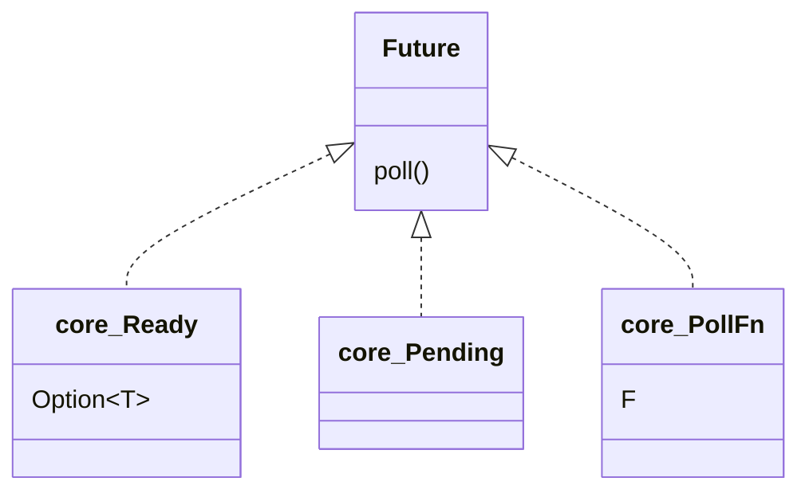
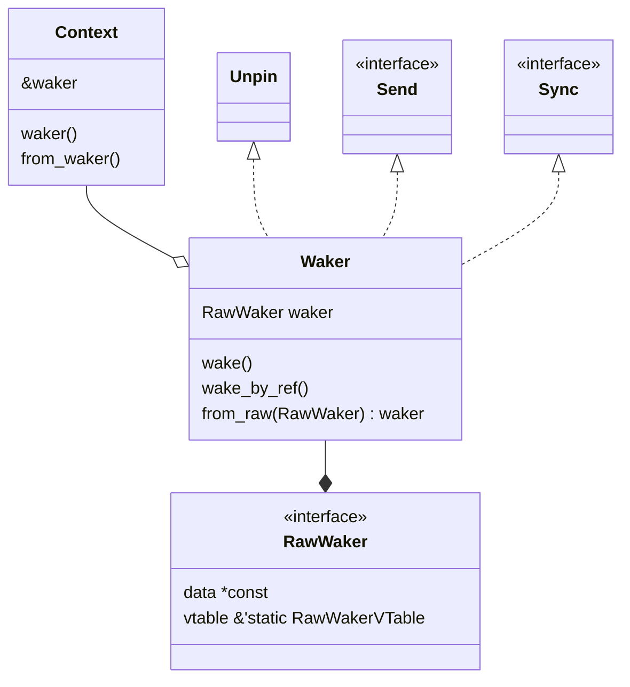
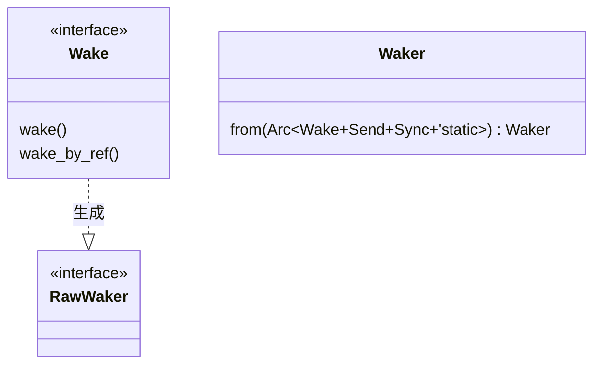
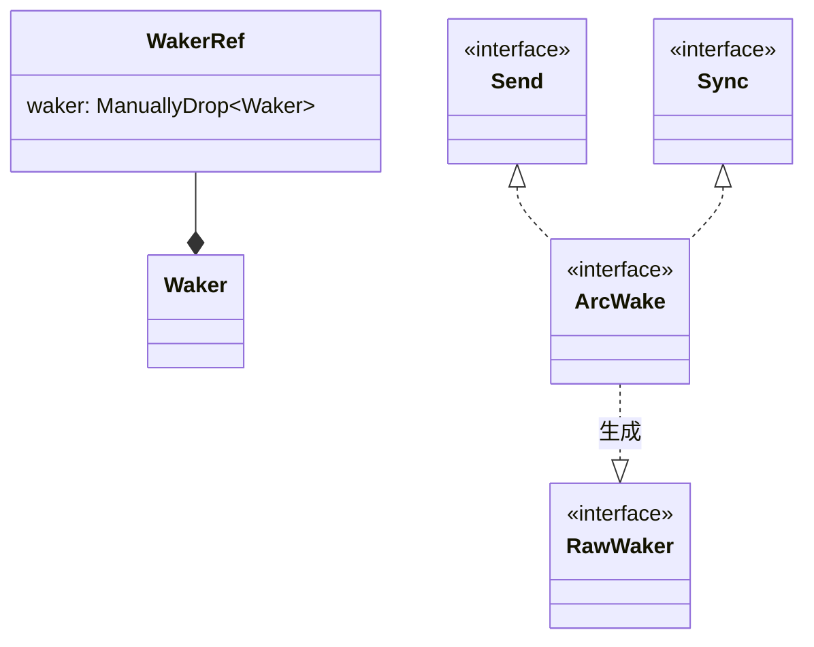

# future

## future

## context

- RawWaker就相当`&dyn RawWaker`，由对象指针和虚函数表组成。所以要不同的Waker，就需要创建不同的RawWaker。

## alloc

- 用实现了Wake+Send+Sync+'static的结构创建Waker

## futures-task

- 用实现了Wake+Send+Sync+'static的结构创建Waker
