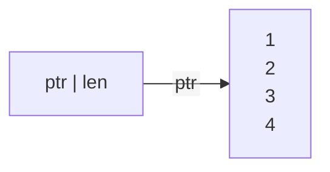
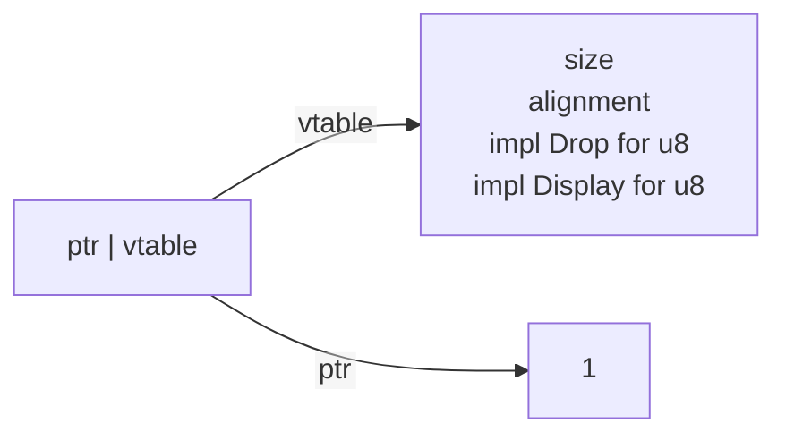

# layout

## 定义
`Layout`是`size`和`align`的组合，`well-align`是指`size`是`align`的整数倍。
```rust
pub struct Layout {
    size: usize,
    align: Alignment,
}
```

## size

大小是固定的类型

| 类型      | 大小(字节) |
| --------- | ---------- |
| `i8`      | 1          |
| `i16`     | 2          |
| `i32`     | 4          |
| `i64`     | 8          |
| `isize`   | 和平台相关 |
| `u8`      | 1          |
| `u16`     | 2          |
| `u32`     | 4          |
| `u64`     | 8          |
| `usize`   | 和平台相关 |
| `bool`    | 1          |
| `f32`     | 4          |
| `f64`     | 8          |
| `[u32;n]` | 4*n        |


## unsize

大小是不固定的类型，无法在栈申请

| 类型        | 大小                    |
| ----------- | ----------------------- |
| `[u32]`     | 4的整数倍               |
| `[u8]`      | 1的整数倍               |
| `str`       | 1的整数倍，和`[u8]`一样 |
| `dyn Trait` | 大小和具体的类型一样    |


## thin pointer

| 类型  | 大小  |
| ----- | ----- |
| `&u8` | 8字节 |
|       |       |


## fat pointer


| 类型          | 大小   | metadata |
| ------------- | ------ | -------- |
| `&[u8]`       | 16字节 | 长度     |
| `&str`        | 16字节 | 长度     |
| `*const [u8]` | 16字节 | 长度     |
| `&dyn Trait`  | 16字节 | vtable   |


### vtable

- 对象的大小，和`slice`类似，`slice`保存的是数组的长度。
- alignment
- `drop`的实现。
- 实现这个特征的实现（函数表）


### &[u8]

例子

```rust
let array = [1,2,3,4];
// 用地址和长度构建fat pointer
let r:*const [i32] = ptr::from_raw_parts(&array as *const [i32] as *const (), 4 as usize);
let r2:&[i32] = unsafe {&*(r as *const [i32])};

// 等价于 let r2 = &array[..], 因为满足Unsize特征
```




### &dyn Trait

例子

```rust
let i1:u8 = 2;
let d1: &dyn Display = &i1;
let metadata = ptr::metadata(d1);
let dyn_metadata = metadata as ptr::DynMetadata<dyn Display>;
assert_eq!(dyn_metadata.size_of(), 1); // u8的size
assert_eq!(dyn_metadata.align_of(), 1);// u8的alignment


let i:u8 = 1;
let r:*const dyn Display = ptr::from_raw_parts(&i as *const u8 as *const (), metadata);
let r2:&dyn Display = unsafe {&*(r as *const dyn Display)};
```




## 深入fat pointer


注意在rust中，指向unsize对象的指针的大小不是8字节，而是16字节。需要一个isize来保存metadata。

看看rust中pointer的结构

```rust
pub const fn metadata<T: ?Sized>(ptr: *const T) -> <T as Pointee>::Metadata {
    // SAFETY: Accessing the value from the `PtrRepr` union is safe since *const T
    // and PtrComponents<T> have the same memory layouts. Only std can make this
    // guarantee.
    unsafe { PtrRepr { const_ptr: ptr }.components.metadata }
}

pub const fn from_raw_parts_mut<T: ?Sized>(
    data_address: *mut (),
    metadata: <T as Pointee>::Metadata,
) -> *mut T {
    // SAFETY: Accessing the value from the `PtrRepr` union is safe since *const T
    // and PtrComponents<T> have the same memory layouts. Only std can make this
    // guarantee.
    unsafe { PtrRepr { components: PtrComponents { data_address, metadata } }.mut_ptr }
}

#[repr(C)]
union PtrRepr<T: ?Sized> {
    const_ptr: *const T,
    mut_ptr: *mut T,
    components: PtrComponents<T>,
}

#[repr(C)]
struct PtrComponents<T: ?Sized> {
    data_address: *const (),
    metadata: <T as Pointee>::Metadata,
}

// Manual impl needed to avoid `T: Copy` bound.
impl<T: ?Sized> Copy for PtrComponents<T> {}

// Manual impl needed to avoid `T: Clone` bound.
impl<T: ?Sized> Clone for PtrComponents<T> {
    fn clone(&self) -> Self {
        *self
    }
}
```

其中，如果PtrRepr中的T是`[u8]`的话

```rust
#[repr(C)]
union PtrRepr<[u8]> {
    const_ptr: *const [u8],
    mut_ptr: *mut [u8],
    components: PtrComponents<[u8]>,
}

#[repr(C)]
struct PtrComponents<[u8]> {
    data_address: *const (),
    metadata: <[u8] as Pointee>::Metadata,
}

// data_address是8字节
// const_ptr和mut_ptr都是16字节
```

