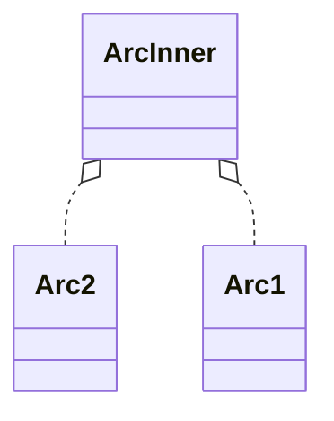

# Arc

Arc与Rc不一样，Arc中引用计算的类型是AtomicUnsize。是线程安全的。

```rust
pub struct Arc<
    T: ?Sized,
    #[unstable(feature = "allocator_api", issue = "32838")] A: Allocator = Global,
> {
    ptr: NonNull<ArcInner<T>>,
    phantom: PhantomData<ArcInner<T>>,
    alloc: A,
}

#[repr(C)]
struct ArcInner<T: ?Sized> {
    strong: atomic::AtomicUsize,
    weak: atomic::AtomicUsize,

    data: T,
}
```

## clone

增加引用计数

```rust
use std::sync::Arc;

let five = Arc::new(5);

let _ = Arc::clone(&five);
```

```rust
impl<T: ?Sized, A: Allocator + Clone> Clone for Arc<T, A> {
    fn clone(&self) -> Arc<T, A> {
        let old_size = self.inner().strong.fetch_add(1, Relaxed);
        if old_size > MAX_REFCOUNT {
            abort();
        }
        unsafe { Self::from_inner_in(self.ptr, self.alloc.clone()) }
    }
}
```



## 弱引用

Weak不会增加引用计数`strong`，内部有另外的引用计数`weak`。`strong`减为0后，内部的对象就会被drop，但如果还有弱引用存在，内存不会被马上回收，要等待所有弱引用释放后，内存才会被回收。此时Weak的upgrade方法会返回None。

```rust
impl<T: ?Sized, A: Allocator> Arc<T, A>
    unsafe fn drop_slow(&mut self) {
        unsafe { ptr::drop_in_place(Self::get_mut_unchecked(self)) };
        drop(Weak { ptr: self.ptr, alloc: &self.alloc });
    }
}
```

> 只是调用drop方法，并不回收内存。

```rust
unsafe impl<#[may_dangle] T: ?Sized, A: Allocator> Drop for Weak<T, A> {
 
    fn drop(&mut self) {
 
        let inner = if let Some(inner) = self.inner() { inner } else { return };
        if inner.weak.fetch_sub(1, Release) == 1 {
            acquire!(inner.weak);
            unsafe {
                self.alloc.deallocate(self.ptr.cast(), Layout::for_value_raw(self.ptr.as_ptr()))
            }
        }
    }
}
```

> 所有弱引用都释放后，回收内存。

## PartialEq特征的优化

上面已经知道两个Arc对象可能指向同一个ArcInner，因为判断两个指针是否相等就可以判断两个Arc对象是否相等了，但有一个条件，T需要实现Eq特征，因为PartialEq有可能是非自反的，即可以不等于自身。

看一下源码中的实现

```rust
trait ArcEqIdent<T: ?Sized + PartialEq, A: Allocator> {
    fn eq(&self, other: &Arc<T, A>) -> bool;
    fn ne(&self, other: &Arc<T, A>) -> bool;
}

impl<T: ?Sized + PartialEq, A: Allocator> ArcEqIdent<T, A> for Arc<T, A> {

    default fn eq(&self, other: &Arc<T, A>) -> bool {
        **self == **other
    }

    default fn ne(&self, other: &Arc<T, A>) -> bool {
        **self != **other
    }
}

impl<T: ?Sized + crate::rc::MarkerEq, A: Allocator> ArcEqIdent<T, A> for Arc<T, A> {

    fn eq(&self, other: &Arc<T, A>) -> bool {
        Arc::ptr_eq(self, other) || **self == **other
    }

    fn ne(&self, other: &Arc<T, A>) -> bool {
        !Arc::ptr_eq(self, other) && **self != **other
    }
}

impl<T: ?Sized + PartialEq, A: Allocator> PartialEq for Arc<T, A> {
    
    fn eq(&self, other: &Arc<T, A>) -> bool {
        ArcEqIdent::eq(self, other)
    }

    fn ne(&self, other: &Arc<T, A>) -> bool {
        ArcEqIdent::ne(self, other)
    }
}
```

