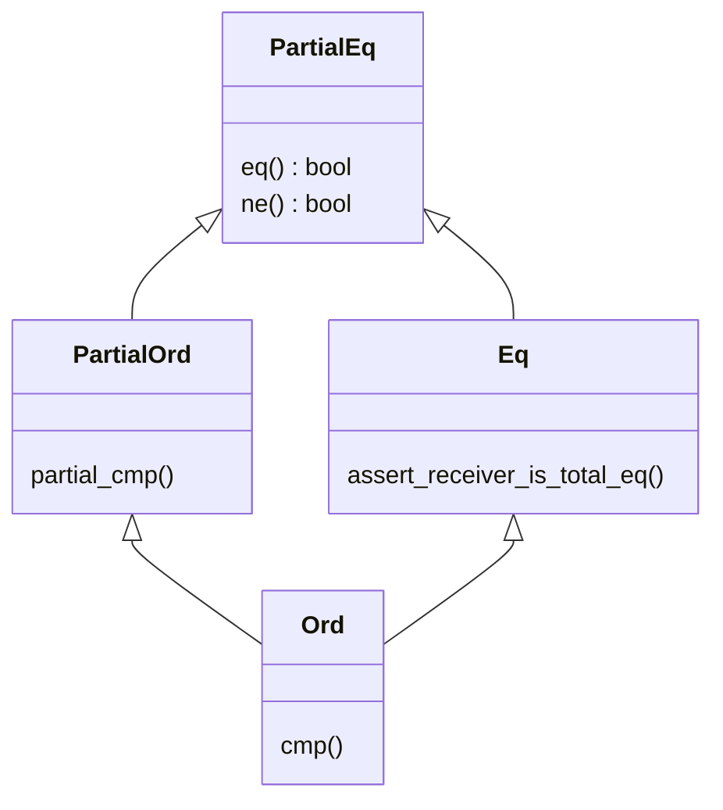

# cmp

```mermaid
classDiagram
	PartialEq <|-- Eq
	PartialEq <|-- PartialOrd
	PartialOrd <|-- Ord
	Eq <|-- Ord
	class Eq {
		assert_receiver_is_total_eq()
	}
	class PartialEq {
		eq() bool
		ne() bool
	}
	class Ord {
		cmp()
	}
	class PartialOrd {
		partial_cmp()
	}
```

## 为什么Ord需要有一个cmp()方法，而Eq不需要？

因为PartialOrd涉及无法确定的比较，因此partial_cmp()的返回值是`Option`，而Ord的cmp()不是返回`Option`。

PartialEq也不涉及无法确定的比较，因此Eq特征没有新增方法。
