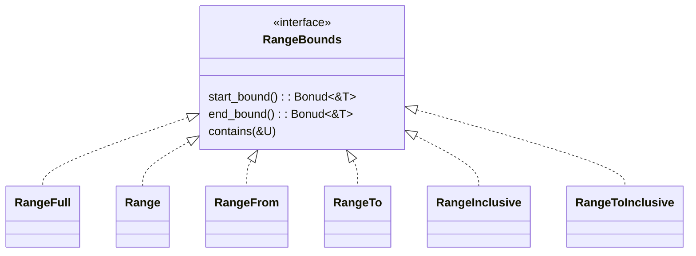

# range

表示范围


## 类型

| -                | -           |
| ---------------- | ----------- |
| RangeFull        | ..          |
| Range            | start..end  |
| RangeFrom        | start..     |
| RangeTo          | ..end       |
| RangeInclusive   | start..=end |
| RangeToInclusive | ..=end      |


## RangeBonuds

所有range都实现了这个特征，这个特征主要是用来做泛型参数的，如

```rust
 pub fn extend_from_within<R>(&mut self, src: R)
    where R: RangeBounds<usize>,
{
    let range = slice::range(src, ..self.len());
    self.reserve(range.len());

    // SAFETY:
    // - `slice::range` guarantees that the given range is valid for indexing self
    unsafe {
        self.spec_extend_from_within(range);
    }
}
```




